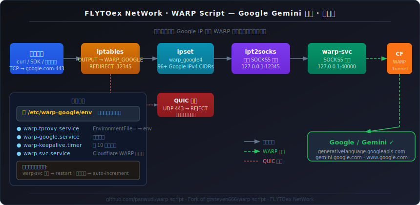

# 🚀 WARP Script — Google Gemini 送中

<div align="center">

**FLYTOex NetWork**  ·  Fork of [gzsteven666/warp-script](https://github.com/gzsteven666/warp-script)


</div>

---

## 这是什么？

在中国大陆的服务器上，访问 Google / Gemini API 会被 GFW 拦截。  
这个脚本在服务器上安装 **Cloudflare WARP**，并通过 **iptables + ipset 透明代理**，将所有发往 Google IP 段的 TCP 流量自动经 WARP 转发——其他流量完全不受影响。

安装完成后，服务器上任何程序（curl、Python SDK、Node.js 等）访问 Google / Gemini，**无需改代码、无需设置环境变量**，直接就通。

> **为什么叫"Google Gemini 送中"？**  
> WARP 在墙内落地，让 Google/Gemini 的流量"送进"中国服务器——反向穿透，形象贴切 😄

---

## 架构图



---

## 工作原理

```
你的程序 (TCP → Google IP:443)
    │
    ▼
iptables OUTPUT — WARP_GOOGLE 链
    │  ipset warp_google4 命中
    │  REDIRECT → 127.0.0.1:${TPROXY_PORT}
    ▼
ipt2socks（透明 SOCKS5 转发器）
    │  读取 SO_ORIGINAL_DST 恢复原始目标
    │  SOCKS5 CONNECT
    ▼
warp-svc SOCKS5 代理（:${WARP_PROXY_PORT}）
    │
    ▼
Cloudflare WARP 隧道
    │
    ▼
Google / Gemini ✓

另：UDP 443 → iptables REJECT（阻断 QUIC，强制走 TCP/TLS）
```

### 端口配置文件（v1.5.0 新增）

所有组件的端口在运行时从 `/etc/warp-google/env` 读取，不再安装时写死：

```ini
# /etc/warp-google/env — 唯一真相来源，自动生成
WARP_PROXY_PORT=40000   # warp-svc SOCKS5 端口
TPROXY_PORT=12345       # ipt2socks 透明代理监听端口
```

修改端口后只需 `warp restart` 即可生效，无需重装。

### 核心组件

| 组件 | 作用 |
|---|---|
| `cloudflare-warp` | WARP 客户端，提供 SOCKS5 出口 |
| `ipt2socks` | 透明 SOCKS5 转发（C 语言，活跃维护，静态二进制） |
| `ipset warp_google4` | Google 全量 IPv4 段，热更新不中断服务 |
| `iptables WARP_GOOGLE` | NAT REDIRECT 规则链 |
| `iptables WARP_GOOGLE_QUIC` | 阻断 QUIC (UDP 443) |
| `/etc/warp-google/env` | 端口配置唯一真相来源（v1.5.0） |
| `warp-keepalive.timer` | 每 10 分钟检测并自愈 |

### 透明代理后端

安装时自动探测，优先级：

1. **ipt2socks**（首选）— 专为 `iptables REDIRECT → SOCKS5` 设计，静态二进制，无依赖，活跃维护。自动从 GitHub Releases 下载，支持 x86_64 / aarch64。
2. **Python asyncio tproxy**（fallback）— ipt2socks 下载失败时自动启用，纯 stdlib，零额外依赖。

查看当前后端：`cat /etc/warp-google/tproxy_backend`

---

## 系统要求

- **OS**：Ubuntu 20.04 / 22.04 / 24.04，Debian 11 / 12，CentOS / Rocky / AlmaLinux 8+
- **架构**：x86_64 / aarch64
- **权限**：root
- **网络**：服务器本身需能访问 Cloudflare（WARP 是出站转发，不是入站翻墙工具）
- **容器**：支持有 `NET_ADMIN` capability 的 Docker / LXC 容器

> ⚠️ **重要**：如果服务器完全无法访问 Cloudflare，WARP 将连不上。香港、新加坡、日本等节点通常正常。  
> 安装前验证：`curl -v --max-time 10 https://engage.cloudflareclient.com/v0i5/reg`

---

## 快速安装

```bash
bash <(curl -fsSL https://raw.githubusercontent.com/panwudi/warp-script/main/warp.sh)
```

选择 `1. 安装/升级` 即可。安装结束后自动运行 8 层逐层诊断。

### 非交互式安装

```bash
bash <(curl -fsSL https://raw.githubusercontent.com/panwudi/warp-script/main/warp.sh) --install
```

### 自定义端口

```bash
WARP_PROXY_PORT=40001 TPROXY_PORT=12346 bash <(curl -fsSL .../warp.sh) --install
```

---

## 管理命令

```
warp status    查看 WARP 状态 + iptables + 后端进程
warp start     启动
warp stop      停止
warp restart   重启
warp test      8 层逐层诊断（通过时显示绿色成功横幅）
warp debug     原始诊断信息（日志 / 端口 / 规则）
warp ip        显示直连 IP 与 WARP IP
warp update    更新 Google IP 段
warp upgrade   升级脚本（含 SHA256 校验）
warp uninstall 完整卸载
```

### 连接成功时的输出

```
╔══════════════════════════════════════════════╗
║  ✓  Google Gemini 送中成功！全部检测通过     ║
╚══════════════════════════════════════════════╝
```

---

## 配置文件

| 路径 | 说明 |
|---|---|
| `/etc/warp-google/env` | **端口唯一真相来源**（v1.5.0 新增） |
| `/etc/warp-google/google_ipv4.txt` | 缓存的 Google IP 段 |
| `/etc/warp-google/tproxy_backend` | 当前后端（`ipt2socks` / `python`） |
| `/etc/systemd/system/warp-tproxy.service` | 透明代理（`EnvironmentFile=` 读端口） |
| `/etc/systemd/system/warp-google.service` | 主服务，开机自启 |
| `/etc/systemd/system/warp-keepalive.timer` | 自愈 timer |
| `/usr/local/bin/warp` | 管理命令 |
| `/usr/local/bin/ipt2socks` | 透明代理二进制 |

---

## 故障排查

### WARP 未连接（第 1 层失败）

```bash
warp debug   # 查看完整日志
# 确认服务器能到 Cloudflare
curl -v --max-time 10 https://engage.cloudflareclient.com/v0i5/reg
# 手动重连
warp-cli disconnect && warp-cli connect && sleep 5 && warp-cli status
```

### 端口冲突（`Another process is bound to the proxy port`）

v1.5.0 已自动处理。若仍有问题：

```bash
cat /etc/warp-google/env   # 查看实际使用的端口
systemctl restart warp-svc  # 重启 warp-svc 释放内部状态
```

### DNS `Operation not permitted`

v1.4.2+ 已修复。脚本自动处理三种场景：symlink / 只读目录 / `chattr +i`（V2bX 等常见）。

### ipset 模块缺失

```bash
modprobe ip_set ip_set_hash_net xt_set
```

### 容器 NET_ADMIN

```yaml
# docker-compose.yml
cap_add:
  - NET_ADMIN
```

---

## 从旧版本升级

直接重新运行安装命令，新版本自动：
- 清理 `redsocks.service` / `/etc/redsocks.conf`（v1.4.x 及更早）
- 复用现有 WARP 注册，不重新注册
- 保留已有 `/etc/warp-google/env` 端口配置

---

## 变更日志

### v1.5.0 — FLYTOex NetWork

- `/etc/warp-google/env` 端口唯一真相来源，`warp-tproxy.service` 使用 `EnvironmentFile=`
- WARP 注册复用（`registration show` 有则跳过 `registration new`）
- 端口冲突三段自动处理：外部进程 → 递增端口；warp-svc 内部占用 → restart 释放
- `warp test` 改为 8 层逐层诊断，通过显示绿色成功横幅
- `configure_warp` 改为轮询等待真实连接状态
- 向后兼容卸载（自动清理旧版本产物）
- 新增 `warp debug` 命令；FLYTOex NetWork 彩色 Banner

### v1.4.2

- ipt2socks 替换停更的 redsocks，Python asyncio 为 fallback
- 修复 DNS `Operation not permitted`（symlink / 只读 / chattr +i）
- 修复卸载 dnf/yum 分支逻辑
- 依赖安装去除 redsocks 硬依赖

---

## 致谢

- [gzsteven666/warp-script](https://github.com/gzsteven666/warp-script) — 原始作者
- [zfl9/ipt2socks](https://github.com/zfl9/ipt2socks) — 透明代理组件
- [Cloudflare WARP](https://1.1.1.1/) — WARP 客户端
